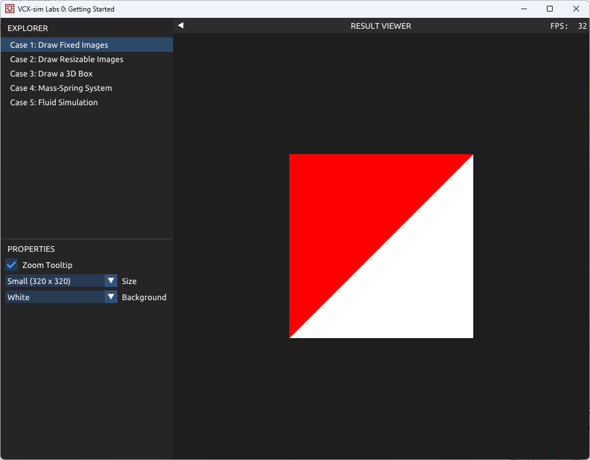
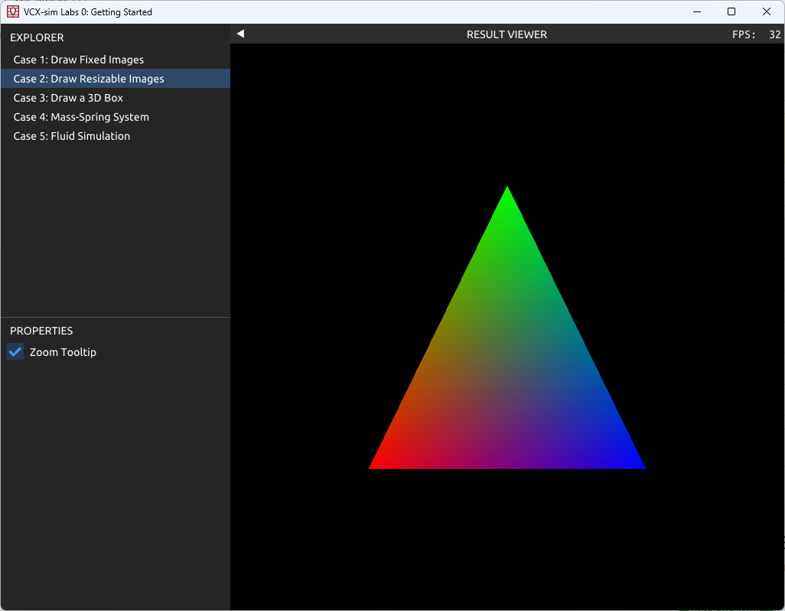
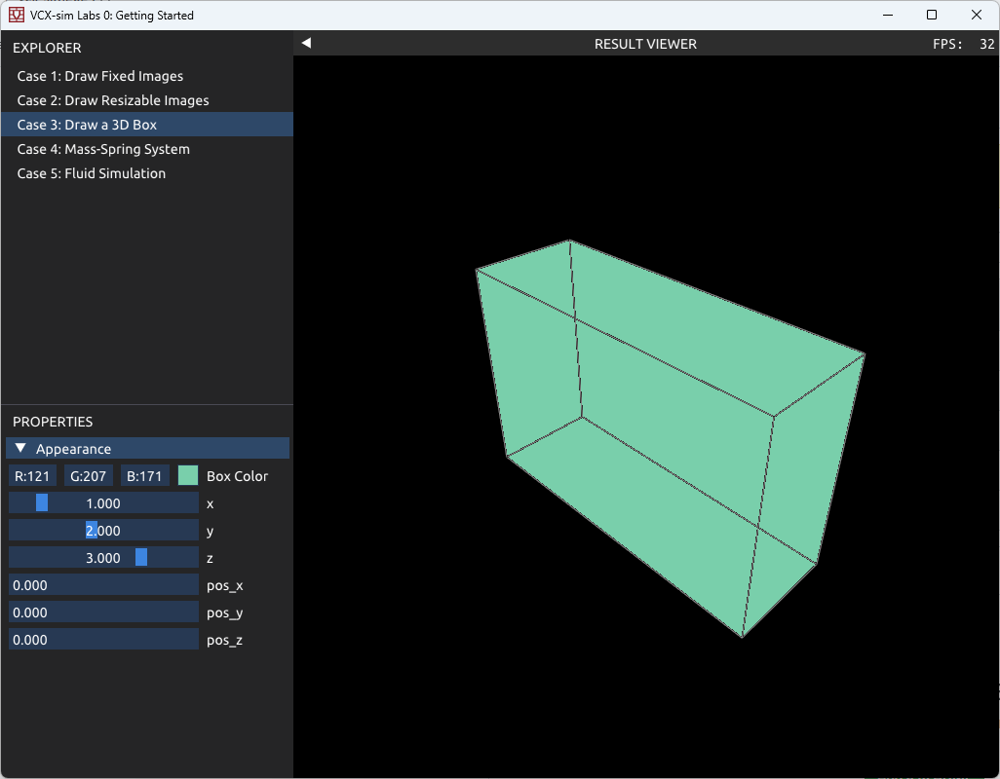
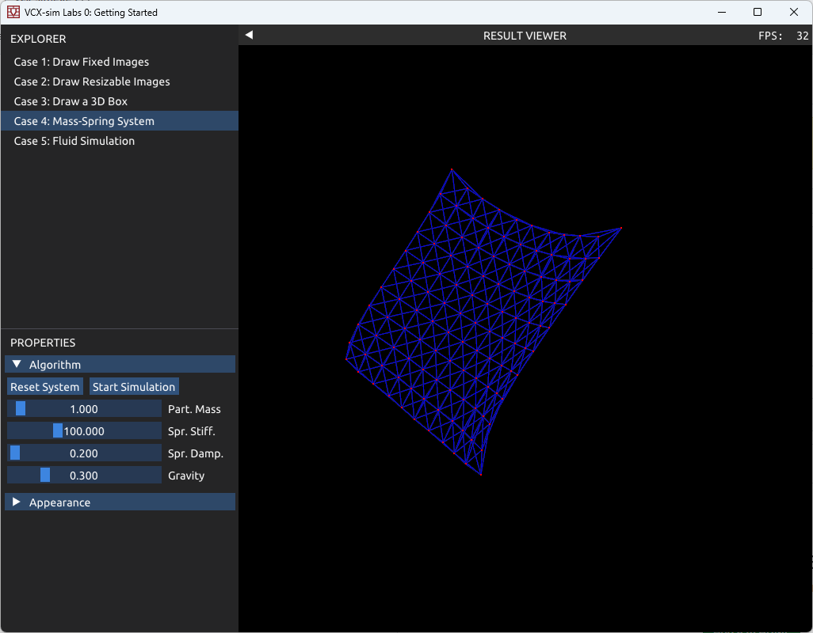
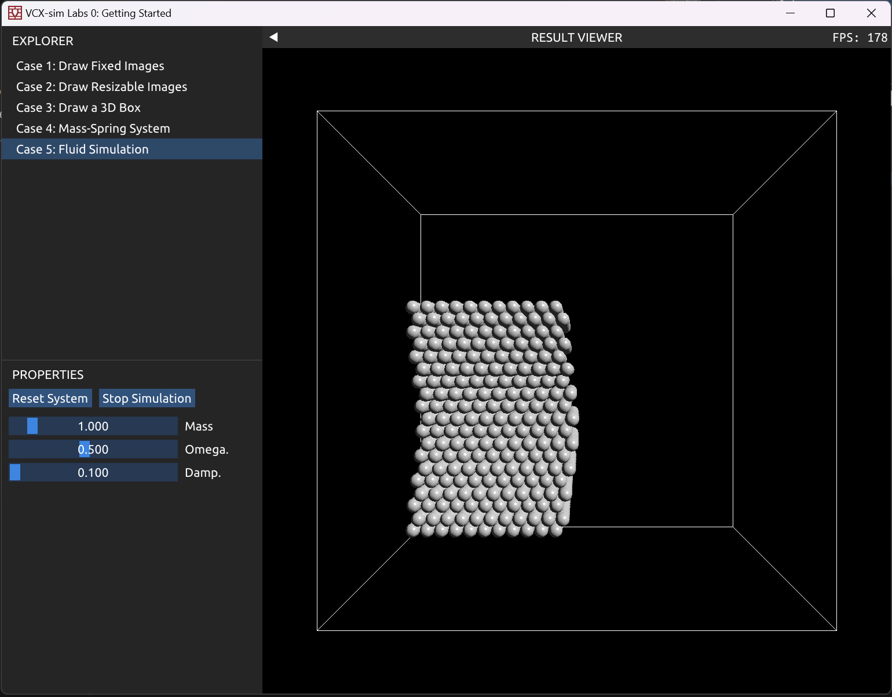

# 图形学物理仿真 Tutorial for Lab 0

## 课程实践（Lab 和 Project） 简介

欢迎大家选修图形学物理仿真课程。我们这学期共需要大家完成紧密围绕课程内容的 3 个 Lab，分别对应这门课程的三大主题：

 1. 刚体
 2. 流体
 3. 弹性体

我们的课程 Lab **不是代码填空**，大家需要自行设计代码结构，从新建文件开始实现模拟部分，因此希望同学们尽早动手。

除此之外，大家也会在学期末完成一项课程 Project。我们会提供一些 Project 题目供大家挑选，同时也很期待看到大家在课堂上找到自己在物理模拟领域感兴趣的方向，并以此作为你的课程 Project。

本学期的 Lab 基于 [vcx](https://gitee.com/pku-vcl/vcx2023/tree/master/) 代码库，大家可以去[可视计算与交互](https://vcl.pku.edu.cn/course/vci)课程了解更多关于代码库的应用。

我们的 Lab 支持 Windows, MacOS 和 Linux 的大多数发行版。如果你需要关于 Lab 的任何帮助，欢迎联系课程助教。

## Lab 0: Build the Codebase

### 1 - Merge Handout Packs

我们的 Lab 位于网址 [https://gitee.com/pku-vcl/vcx-sim2024.git](https://gitee.com/pku-vcl/vcx-sim2024.git) 。首先你需要按照 [Git 官网](https://git-scm.com/) 的指引安装 Git。安装好 Git 之后，使用 Git 将 Lab 仓库 clone 到你喜欢的目录下，这将建立一个名为 `vcx-sim2024` 的目录：这就是你这个学期做所有 Lab 的目录。

```shell
git clone https://gitee.com/pku-vcl/vcx-sim2024.git
```

### 2 - Prepare Compiler

我们的 Lab 需要一个支持 C++20 标准的编译器。推荐使用以下编译器：

- Visual Studio 2019 以上版本，推荐 Visual Studio 2022
- GCC 10 以上版本，推荐 GCC 12
- XCode 13 以上版本
- Clang 13 以上版本

建议使用最新版本的相应编译器。

### 3 - Prepare Git and xmake

我们的 Lab 使用 xmake ([Home](https://xmake.io/)) 作为构建工具，而 xmake 依赖 Git 完成包管理等核心功能，请确保已经安装了 [Git](https://git-scm.com/) 。通过 [xmake安装说明](https://xmake.io/#/guide/installation) 中对于你的平台的描述，安装 xmake。完成安装后，可以在终端中运行 `xmake --version` 来确认安装正确。

接下来，你只需要在终端中进入 `vcx-sim2024` 目录（下同），然后在命令行中输入 `xmake` 并执行，你就会看到 xmake 自动识别你的平台，下载所有依赖库并完成编译和链接；注意 Windows 下使用 gitbash 终端或者 Anaconda Powershell Prompt 可能无法正常编译，请使用 Windows PowerShell；注意这里可能遇到一些网络问题，可以参见FAQ中网络错误的部分。

继续执行 `xmake run lab0`，如果一切顺利，你会看到一个界面，通过界面可以切换显示方框中的五个 Case。







Case 1 和 Case 2 展示了二维作图，以及图形学常见的画三角形。

Case 3 展示了如何渲染一个三维盒子，你可以基于此完成刚体的 Lab。同时 Case 3 还实现了简单的交互，除了使用鼠标左右键以及WASDEQ移动相机以及滚轮缩放，Case 3 还实现了按住 Alt 键用鼠标左键拖动物体。你可以基于此实现自己的交互。

Case 4 展示了隐式弹簧质点模型，你可以借鉴这个例子中的仿真流程。

Case 5 展示了流体的渲染，这个例子中流体粒子做简单的简谐运动。现有基础的流体场景搭建，你需要在lab2中更改`Simulator`进行对应算法的实践。

在编译过程中，你可能遇到一些问题。我们为常见的问题提供了 xmake FAQ（见后文）。如果它无法解决你的问题，欢迎联系课程助教。

### 4 - Prepare for IDEs

接下来，你可能会想要让你喜欢的 IDE 了解 xmake 项目，以提供智能提示，调试器集成等功能：

 -  Visual Studio: 
    执行 `xmake project -a x64 -k vsxmake ./build`。
    你会在 `vcx/build/vsxmake20xx` 目录下找到 .sln 解决方案文件。

 -  XCode:
    执行 `xmake project -k xcode ./build`。
    你会在 `vcx/build/xcode` 目录下找到 XCode 项目文件。

 -  VS Code（图形化配置方案）：
    
    1. 首先执行 `xmake project -k compile_commands ./.vscode` 。
    2. 安装 C/C++ 插件与 XMake 插件。
    3. 选中顶部的 `View -> Command Palette...` ，输入 `XMake:` ，选择 `XMake: Update Intellisense` 。
    4. 选中顶部的 `View -> Command Palette...` ，输入 `C/C++:` ，选择 `C/C++: Edit Configurations (UI)` 。
    5. 选中 `C++ standard` 项，修改设置为 `C++20` 。
    6. 拉到最下方，点开 `Advanced Settings` ，在 `Compile Commands` 一栏输入 `${workspaceFolder}/.vscode/compile_commands.json`
    7. 返回 cpp 文件，现在 VS Code 应该已经能提供智能提示等功能了。
    
 -  VS Code（命令行配置方案）：
    首先执行 `xmake project -k compile_commands ./.vscode` 。
    然后你需要在 `vcx/.vscode` 目录下新建一个名为 `c_cpp_properties.json` 的文件，并写入：
    
    ```json
    { "configurations": [ { "name": "Default", "compileCommands": "${workspaceFolder}/.vscode/compile_commands.json" } ], "version": 4 }
    ```
    
    这样 VS Code 就能找到刚才命令生成的 `compile_commands.json` 并用它来帮助理解 C++ 项目了。

### xmake FAQ

- Q. 在 Windows 的 PowerShell 中输入 `xmake` 后显示「xmake : 无法将“xmake”项识别为 cmdlet、函数、脚本文件或可运行程序的名称」怎么办？

- A. 确保你已经通过 powershell 安装了 xmake；如果是通过下载 exe 安装包安装的 xmake，需要按照官网说明手动配置环境变量。

- Q. 在命令行中输入 `xmake` 后显示「note: xmake.lua not found, try generating it」怎么办？

- A. 确保命令行当前所在的文件夹是 `vcx-sim2024` ，如果不是，通过 cd 指令转到正确的路径。

- Q. 首次在命令行中输入 `xmake` 后需要安装一些包，此时报错下载失败并且能够看到「we can also download these packages manually」及「error: curl: (56) Recv failure: Connection was reset」字样怎么办？

- A. 这是因为访问 Github 时遇到了网络问题，有两种解决方案：
  - 打开本地代理，使用命令行设置好环境变量 `HTTPS_PROXY="127.0.0.1:<port>"`，之后在命令行中运行xmake
  
    + 例如，当你使用wallesspku时，默认端口一般是7890，此时在命令行中运行：
  
    + MacOS/Linux
  
      ```shell
      HTTPS_PROXY="127.0.0.1:7890" xmake
      ```
  
    + Windows cmd
  
      ```shell
      set HTTPS_PROXY=127.0.0.1:7890
      xmake
      ```
  
    + Windows Powershell
  
      ```shell
      $env:HTTPS_PROXY = "127.0.0.1:7890"
      xmake
      ```
  
  - 可运行 `xmake g --pkg_searchdirs=<download-dir>` 并根据报错提示，手动下载软件包并重命名为指定名字
  
    + 一般情况，下载的软件包不用改名就可以识别到。一种方便的方式是将浏览器的默认下载路径加入搜索路径，例如如果在 Windows 上使用 Edge 浏览器，则默认下载路径为 `C:\Users\<username>\Downloads`，设置

      ```shell
      xmake g --pkg_searchdirs=C:\Users\<username>\Downloads
      ```

      这样在 VSCode 自带终端等比较智能的终端中，按住 Ctrl+单击报错信息提示的下载url 跳转到浏览器下载，等一小会重新运行 xmake 即可。这种方法适用于使用浏览器插件作为代理或者不喜欢每次在命令行进行设置的同学。
  
- Q. 在命令行中输入 `xmake` 报错找不到编译器或「cannot get program for cxx」怎么办？？

- A. xmake 在各平台会默认使用该平台原生工具链，例如 Windows 上的 Visual Studio，MacOS 上的 XCode，Linux 上的 GCC，而对其他的工具链会报错找不到编译器。如果要使用 Msys2 提供的GCC编译器，在 Windows 上运行：
  ```shell
  xmake f -p mingw
  ```
  再执行编译步骤。如果要使用 Clang 编译器，运行
  ```shell
  xmake f --toolchain=clang
  ```
  再执行编译步骤。

- Q. 在 Windows 的 powershell 中输入 `xmake`，提示找不到 Visual Studio，但是我明明安装了怎么办？

- A. 首先确保 Visual Studio 的安装路径不含中文，如果含中文需要重新安装到其他路径。其次打开 Visual Studio Installer，找到 `使用 C++ 的桌面开发` ，在可选项中查看 `对 v1xx 生成工具(最新)的 C++/CLI 支持` 一项是否勾选，如果未勾选，安装这一项并重新尝试编译。

- Q. 我的系统上安装了多个编译器，怎样指定使用哪一个编译器编译？

- A. xmake 对编译器提供了全局缓存。如果你新安装了一个编译器，需要使用`xmake g -c`清理全局缓存，再在项目目录运行`xmake f -c`重新探测编译器。对不同的编译器，有不同指定版本的方式。例如，指定使用 Visual Studio 2022：
  ```shell
  xmake f --vs=2022
  ```
  指定使用gcc11：
  ```shell
  xmake f --toolchain=gcc-11
  ```

- Q. 我使用 Mac OS 系统，安装时报错 `invalid Darwin version number: macos 12.3`

- A. 使用的 XCode 版本过低，将 XCode 更新到最新版本即可。

### 写在后面

到这里，你应该已经能够编译运行我们提供的 Lab 代码，并能够在舒适的开发环境中进行开发了。如果想要进一步了解 Lab 代码可以阅读[这篇指南](https://vcl.pku.edu.cn/course/vci/labs/engine.pdf)，也可以向助教提出你的疑问。

衷心欢迎大家对我们的课程和 Lab 设计提出自己的看法，\*也许明年的 Lab 代码库就是你的作品哦\*。

最后，这门课程由北京大学可视计算与学习实验室独家荣誉出品，这里有最前沿的可视计算研究，最宽松的学习氛围，最 nice 的学长学姐，欢迎大家来玩！详情请咨询课程助教~
