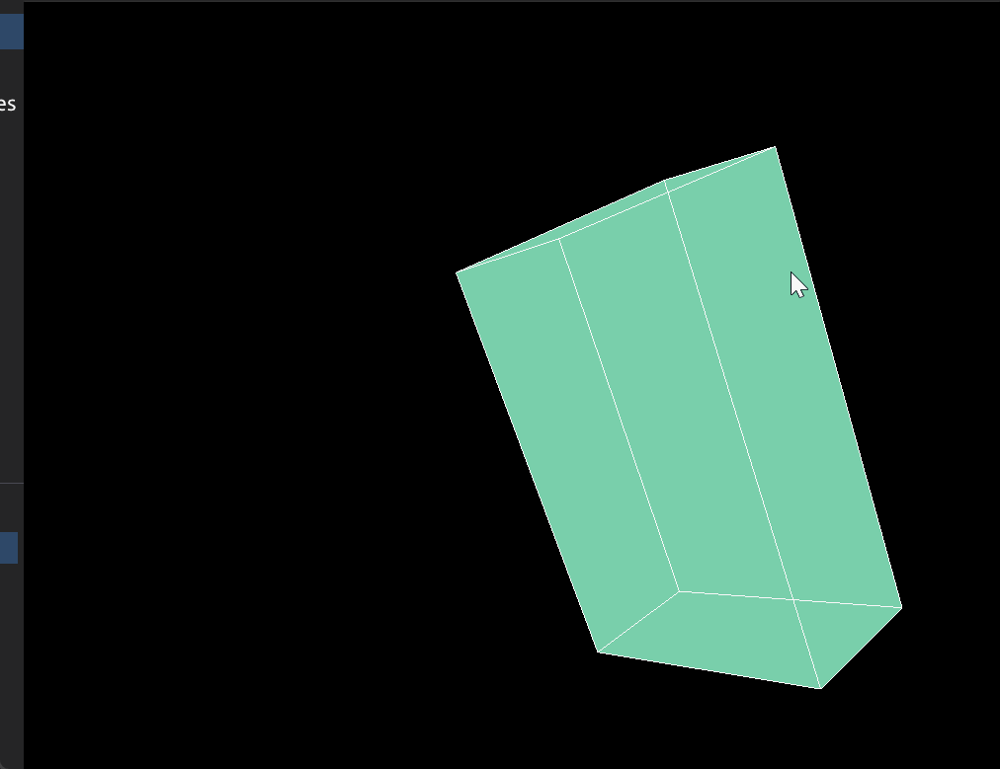
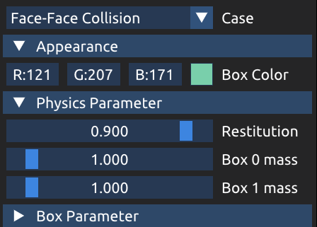
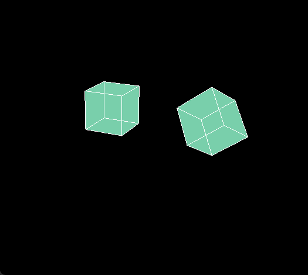
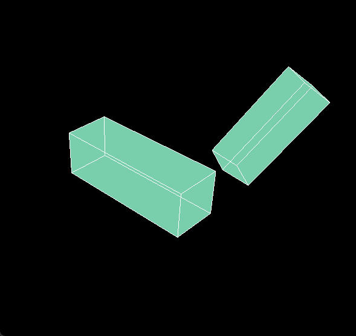
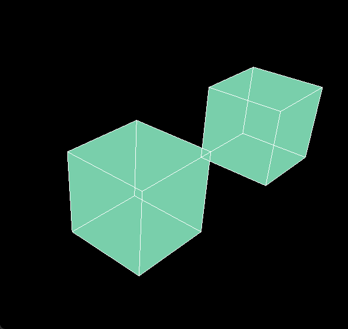
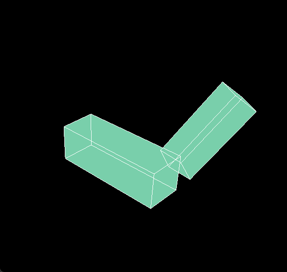
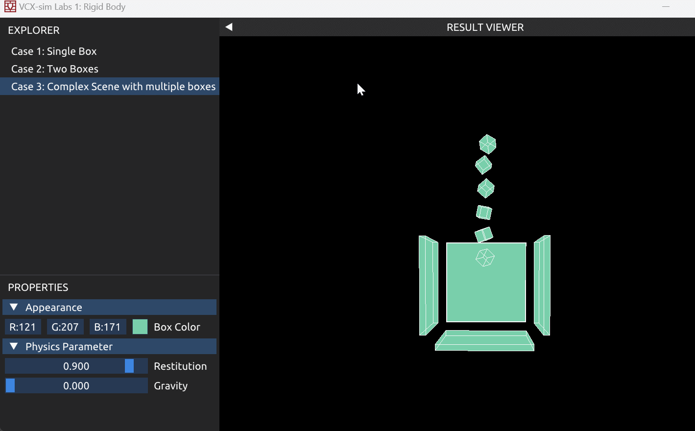
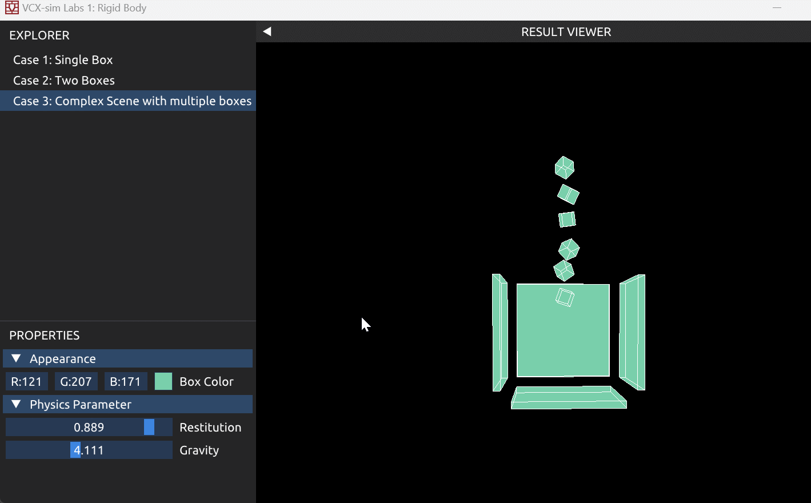
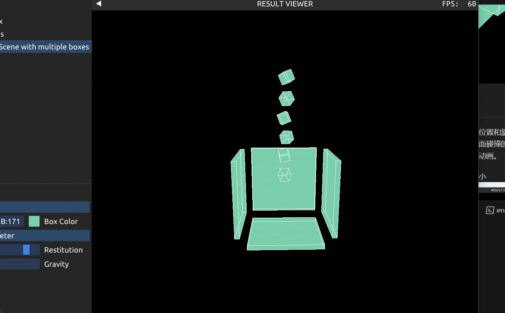

# Lab 1 报告

## Part 1
可以通过按住Alt键的同时，拖动鼠标，对长方体施加外力，改变长方体的旋转。
其中，力的作用点通过将屏幕坐标投影回世界坐标得到。具体实现见`Labs/Common/ForceManager.cpp`
效果如下：

## Part 2
可使用左下角的下拉框和文本框调整所展示的例子和物理参数。按**F键**可以重新播放动画，或者启用文本框内所输入的物理参数。
**调整菜单：**

实现的效果如下：

**点面碰撞：**

**边边碰撞：**

**面面碰撞：**

调整物理参数后的效果（弹性系数改为0，物体1的质量改为10，物体2的质量改为1）：

## Part 3
实现了四个从高处下落的小正方体（位置和旋转带有一定随机性）和一个固定地面已经两个固定墙面碰撞的效果。按**F键**会重新生成小正方体的位置，并重新播放动画。

可以通过拖动左侧滚动条调整重力大小

也可以改变弹性系数

最后，可以通过按照Alt键的同时拖动鼠标改变地面的位置。
