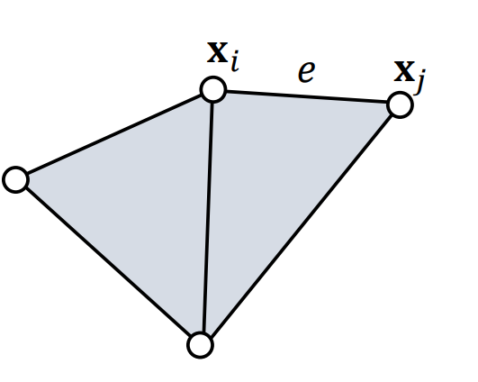
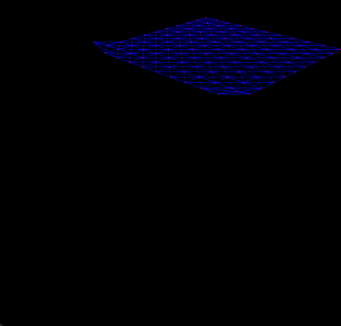
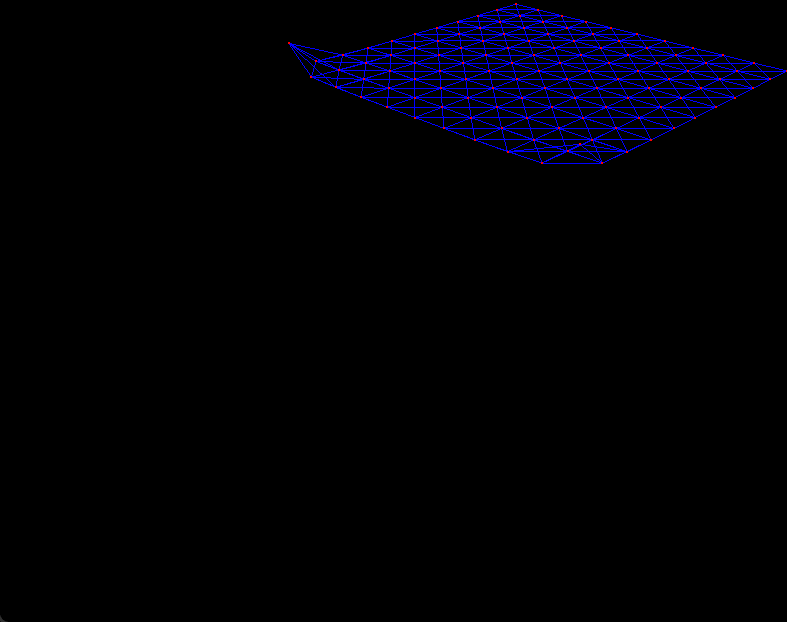

# Lab 4 报告

本次作业实现了基于Projective Dynamics的弹簧布料仿真。

## 代码实现思路

参考Fast Simulation of Mass-Spring Systems，使用Local Step和Global Step迭代的方法解算质点下一时刻的位置。

$\mathbf{x}_{n+1}=argmin_{\mathbf{x}}g(\mathbf{x})$,其中$g(\mathbf{x})=\frac1{2h^2}|\mathbf{x}-\mathbf{y}|_{\mathbf{M}}^2+E(\mathbf{x})$

### Local Step

对于每根连接质点编号为$i$,$j$弹簧，使用如下公式计算$\mathbf{x}_{ij}^{\mathrm{new}}$与$\mathbf{x}_{ji}^{\mathrm{new}}$：

$$
\mathbf{x}_{ij}^{\mathrm{new}}\leftarrow\mathbf{x}_i-\frac{m_j}{m_i+m_j}(\|\mathbf{x}_i-\mathbf{x}_j\|-L)\frac{\mathbf{x}_i-\mathbf{x}_j}{\|\mathbf{x}_i-\mathbf{x}_j\|}
$$

$$
\mathrm{x}_{ji}^\mathrm{new}\leftarrow\mathrm{x}_j+\frac{m_i}{m_i+m_j}(\|\mathrm{x}_i-\mathrm{~x}_j\|-L)\frac{\mathrm{x}_i-\mathrm{~x}_j}{\|\mathrm{x}_i-\mathrm{~x}_j\|}
$$

### Global Step
求解$\mathbf{x}_{n+1}=\text{argmin}_\mathbf{x}g(\mathbf{x})$，其中$g(\mathbf{x})=\frac{1}{2h^2}|\mathbf{x}-\mathbf{y}|_\mathrm{M}^2+\sum\frac{1}{2}k\|\mathbf{x}_{ij}-\mathbf{x}_{ij}^\mathrm{new}\|^2$

由于$g(\mathbf{x})$为一个二次式，因此，其最小值可通过求解线性方程解出。

$$\left(\frac1{h^2}\mathbf{M}+\mathbf{H}\right)\Delta\mathbf{x}=-\frac1{\Delta t^2}\mathbf{M}(\mathbf{x}_k-\mathbf{y})+\mathbf{f}(\mathbf{x}_k)$$
其中，$\mathbf{x}+\Delta\mathbf{x}$为下次迭代的结果，$\mathbf{H}$为函数$g$的Hessian矩阵，$f$为函数$\sum\frac{1}{2}k\|\mathbf{x}_{ij}-\mathbf{x}_{ij}^\mathrm{new}\|^2$的梯度，即质点所受的所有弹簧的合力的近似值。

$\mathbf{H}$与$f$的具体形式直接参考了PPT上结果。比如，对下图

有
$$\mathbf{H}=\begin{bmatrix}3\mathbf{I}&-\mathbf{I}&-\mathbf{I}&-\mathbf{I}\\-\mathbf{I}&2\mathbf{I}&-\mathbf{I}\\-\mathbf{I}&-\mathbf{I}&3\mathbf{I}&-\mathbf{I}\\-\mathbf{I}&&-\mathbf{I}&2\mathbf{I}\end{bmatrix}$$

$$
\mathbf{f}_i=-\sum_{e:i\in e}(\mathbf{x}_i-\mathbf{x}_j)-(\mathbf{x}_{e,i}^\mathrm{new}-\mathbf{x}_{e,j}^\mathrm{new})
$$

### Damping
在论文Fast Simulation of Mass-Spring Systems中，作者提出使用最简单的Damping方法，即设置$y=x+\tilde{v}\Delta{t}$，其中$\tilde{v}=\alpha v$，$\alpha$为一个小于1但很接近1的数值。但由于该方法过于简单，且仿真效果与$\Delta{t}$的选取关系很大，我们选取了Lab0中使用的方法，即添加力$f_{d}=-Dv$。

此外，由于Damping添加的力是非保守力，难以与Projective Dynamics结合，我们使用显示欧拉法计算$f_d$，在实验中发现，仅对$f_d$使用显示欧拉法计算并不会导致仿真的不稳定。

### 交互
在质点上拖拽以增加力，完成了交互。具体实现方法是先找出与鼠标所代表的光线最接近的质点，作为力的施加点。根据鼠标的滑动距离确定力的大小和方向。此外，为了更好的交互效果，在对一个质点施加力的同时，对其附近的质点也施加一个方向相同的力，大小随着该质点与力的作用点之间的距离衰减。

# Demo
使用默认参数（与Lab0相同）的仿真效果如下

使用较软的弹簧的仿真效果如下（物理参数可在左侧工具栏设置）

可以在按住Alt键的同时，拖动布料实现交互（拖动范围和力的大小可在左侧工具栏设置），可以看到布料的自碰撞由于没做处理，并不能被正确地解除。
